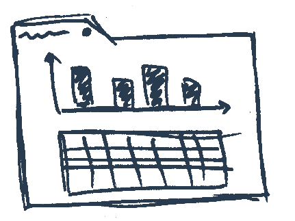
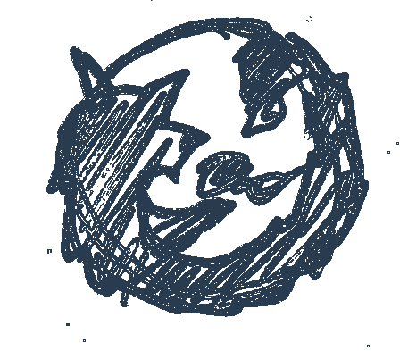
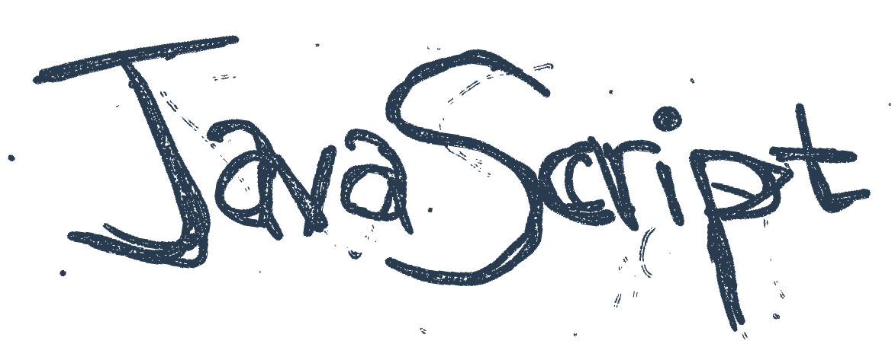
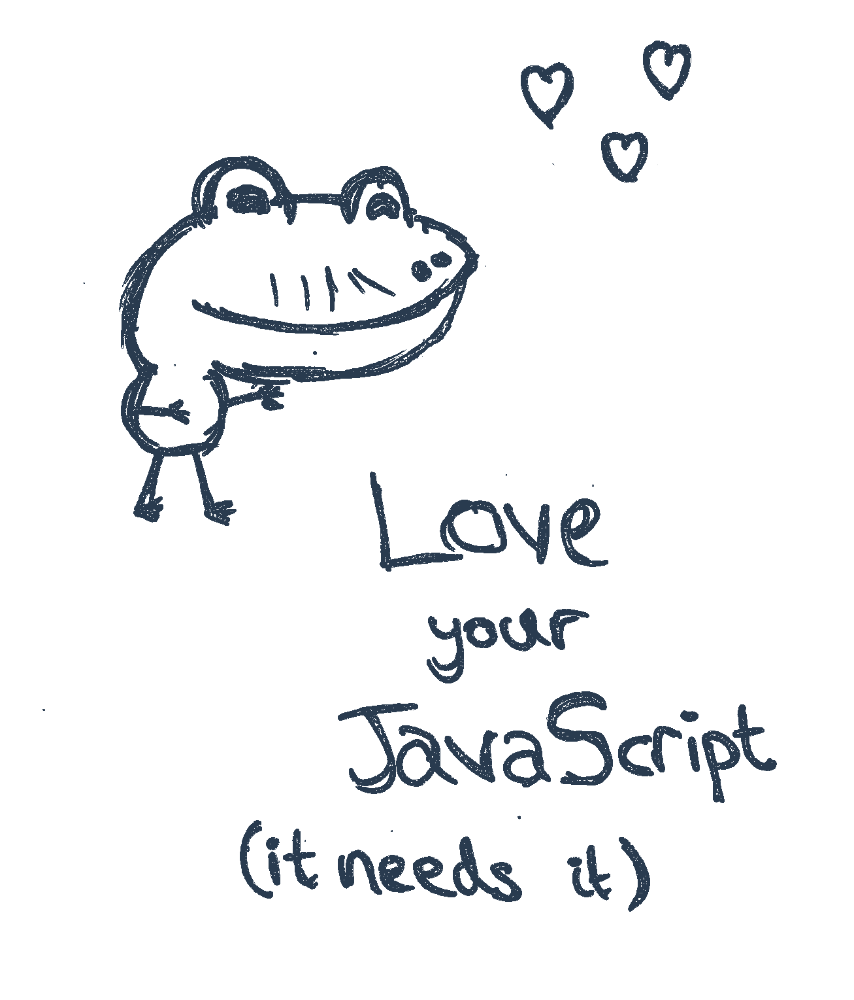
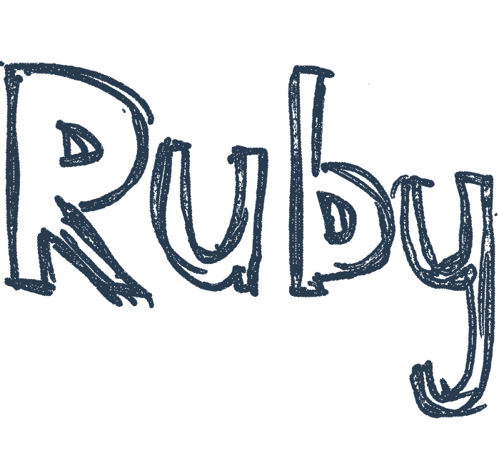
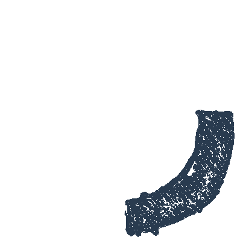

# Given at Scottish Ruby Conference 2013
## Slides at [SpeakerDeck](https://speakerdeck.com/latentflip/back-to-front-one-mans-journey-from-server-to-client-side)
## Video soon
## Original assets below

 Back To Front by <a xmlns:cc="http://creativecommons.org/ns#" href="https://github.com/latentflip/scottish-ruby-conf-2013-talk" property="cc:attributionName" rel="cc:attributionURL">Philip Roberts</a> is licensed under a <a rel="license" href="http://creativecommons.org/licenses/by-nc-sa/2.5/scotland/deed.en_US">Creative Commons Attribution-NonCommercial-ShareAlike 2.5 UK: Scotland License</a>.

 Back To Front by <a xmlns:cc="http://creativecommons.org/ns#" href="https://github.com/latentflip/scottish-ruby-conf-2013-talk" property="cc:attributionName" rel="cc:attributionURL">Philip Roberts</a> is licensed under a <a rel="license" href="http://creativecommons.org/licenses/by-nc-sa/2.5/scotland/deed.en_US">Creative Commons Attribution-NonCommercial-ShareAlike 2.5 UK: Scotland License</a>.
